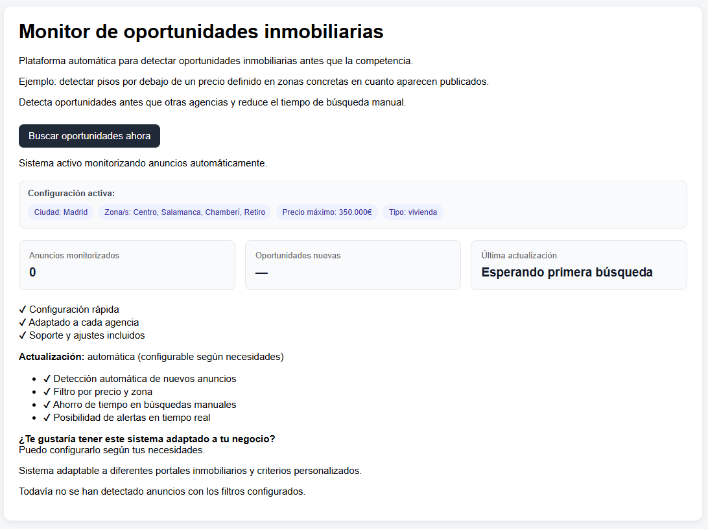
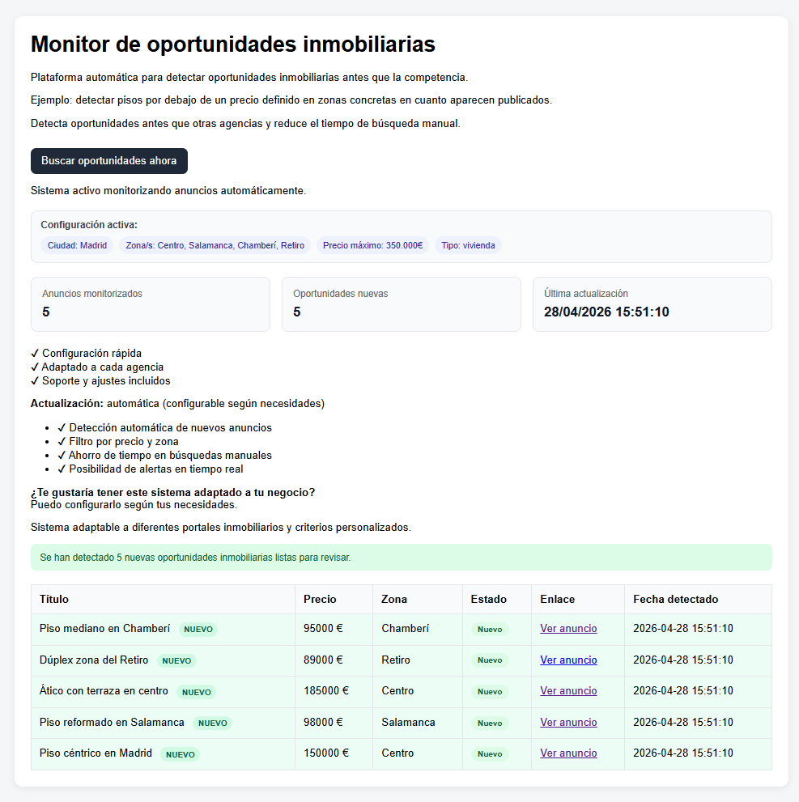
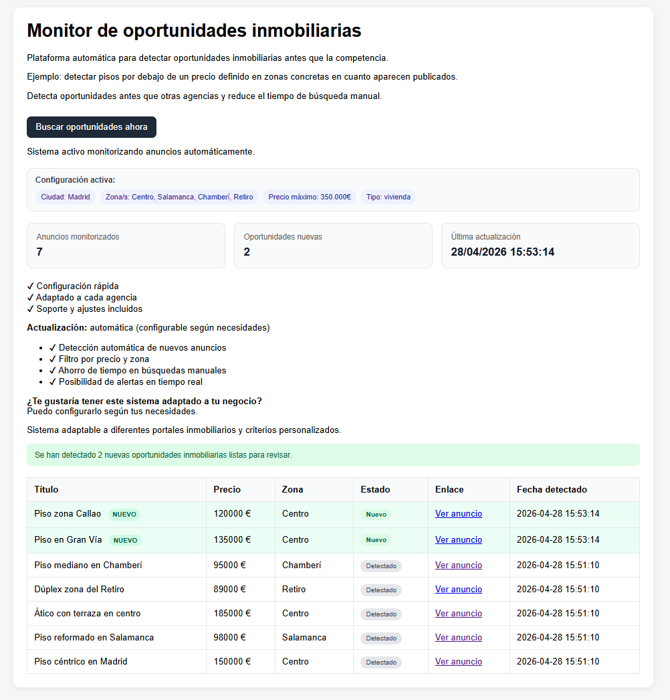

# Real Estate Monitor Zaragoza

Aplicación web desarrollada en Python y Flask para detectar oportunidades inmobiliarias en Zaragoza según criterios de precio y zona.

El objetivo del proyecto es automatizar la búsqueda de anuncios relevantes, almacenarlos en una base de datos y visualizarlos desde un panel web sencillo.

## Funcionalidades

- Detección de anuncios inmobiliarios.
- Filtrado por precio y zona.
- Almacenamiento en SQLite.
- Panel web para consultar oportunidades.
- Sistema preparado para adaptarse a distintos portales.
- Estructura modular con separación entre scraping, base de datos, configuración y notificaciones.

## Tecnologías utilizadas

- Python
- Flask
- SQLite
- BeautifulSoup
- Requests
- HTML
- CSS
- Git

## Capturas

### Panel inicial


### Oportunidades detectadas


### Nuevas oportunidades


## Estructura del proyecto

```text
real-estate-monitor-zaragoza/
├── app.py
├── scraper.py
├── database.py
├── notifier.py
├── config.py
├── requirements.txt
├── templates/
├── static/
└── screenshots/


